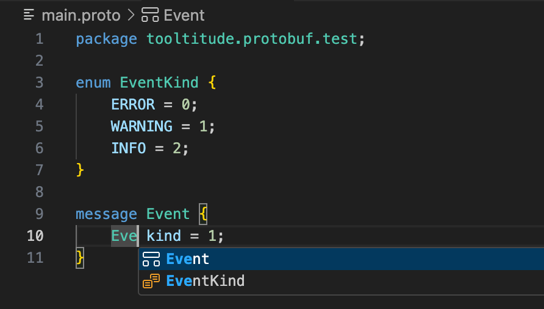

# TooltitudePb

TooltitudePb is an extension providing language services for Protobuf / proto files. It includes language server with formatter, navigation, code completion, find references for messages and enums. Also includes syntax highlighting, code snippets, and other features.

## Features
NOTE: Features may have limitations. 

- Navigation on imports
- Navigation on type references (enums, and messages)
- Find references for messages and enums
- Formatter (You could turn it off with the `tooltitude.pb.formatterEnabled` setting. You could configure it with the `tooltitude.pb.indentSize` and `tooltitude.pb.tabIndent settings`)
- Syntactic error checking
- Naming checking (controllable via the `tooltitude.pb.inspection.namesEnabled` setting)
- Reference checking (controllable via `tooltitude.pb.refsCheckEnabled`)
- Imports checking (controllable via `tooltitude.pb.importsCheckEnabled`)
- Discouraged constructs checking (controllable via `tooltitude.pb.inspection.discouragedEnabled`)
- Checks for issues with field tags (controllable via `tooltitude.pb.inspection.fieldTagChecksEnabled`). NOTE: Extensions aren't checked.
- Checks for issues with fields names (controllable via the `tooltitude.pb.inspection.duplicatedFieldChecksEanbled` setting). NOTE: Extensions aren't checked.
- Shrink/Expand selection support
- Folding support
- Hover for type references
- Navigate to symbol for messages, enums, and services
- Outline and local symbols for messages, enums, services, and rpcs
- Ability to set includes path via the `tooltitude.pb.includes` setting

## Snippets
- proto2 and proto3 syntax
- 2023 edition
- package
- import
- message, enum, service, extend and oneof declarations

## Data
You could read about data collection in our privacy policy: https://www.tooltitude.com/privacy

## Support Resources
* Report an issue: https://github.com/tooltitude/support-pb/issues/new/choose
* Discord community: https://discord.gg/f9MHBXsVwr

## Other Links
* Our site: https://www.tooltitude.com/
