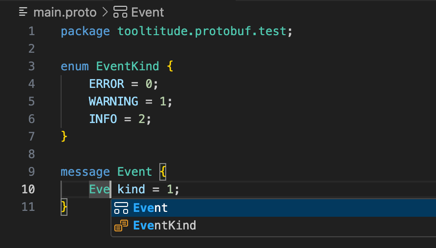

# Tooltitude for Protobuf (proto files)

Tooltitude for Protobuf is a vscode extension providing various language services for Protobuf. The extension is being actively developed so stay tuned for new features.

## Languge Service Features

- Navigation on imports
- Navigation on type references (enums, and messages)
- Formatter (you could turn it off with the tooltitude.pb.formatterEnabled setting)
- Shrink/Expand selection support
- Folding support
- Navigate to symbol for messages, enums, and services
- Outline and local symbols for messages, enums, services, and rpcs

## Snippets

- proto2 and proto3 syntax
- 2023 edition
- package
- import
- message, enum, service, extend and oneof declarations

## Data
We collect anonymous usage data in order to improve our products. To opt-out of data collections, turn off application-wide telemetry setting in VS Code as directed by the VS Code documentation before installing the extension, or at any time after the installation: https://code.visualstudio.com/docs/supporting/faq#_how-to-disable-telemetry-reporting Our extension respects this global setting as directed by extension guidelines published by Microsoft. You could read more about our privacy policy here: https://www.tooltitude.com/privacy

## Support Resources
* You could ask for help or suggest a feature by creating an issue in this repository: https://github.com/tooltitude/support-pb/issues/new/choose
* You could join our Discord community: https://discord.gg/f9MHBXsVwr

## Other Links
* Visit our site: https://www.tooltitude.com/
* Follow us on X: https://twitter.com/tooltitude
